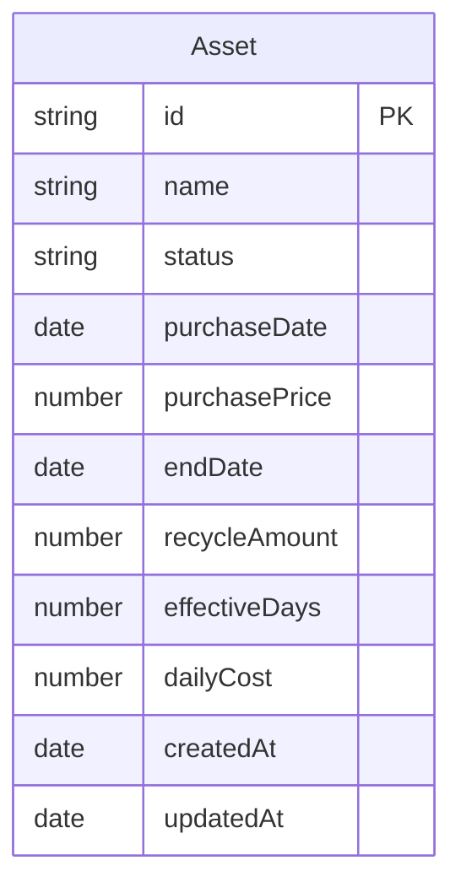

## 1. 架构设计

```mermaid
graph TB
    subgraph "前端层"
        "React SPA" --> "Zustand Store"
        "Zustand Store" --> "LocalStorage Adapter"
    end
    subgraph "数据层"
        "LocalStorage Adapter" --> "Browser localStorage"
    end
    subgraph "外部交互"
        "React SPA" --> "JSON 导出/导入"
    end
```

纯前端架构，无需后端服务。所有数据存储在浏览器 localStorage 中，支持 JSON 格式的数据导入导出。

## 2. 技术说明
- 前端框架：React@18 + TypeScript + Vite
- 样式方案：Tailwind CSS@3
- 状态管理：Zustand
- 图表库：Recharts
- 日期处理：date-fns
- 路由：react-router-dom@6
- 图标：lucide-react
- 初始化工具：vite-init（react-ts 模板）

## 3. 路由定义
| 路由 | 用途 |
|------|------|
| / | 仪表盘 - 资产总览和统计图表 |
| /assets | 资产列表 - 所有物品的卡片视图 |
| /assets/new | 添加新资产 |
| /assets/:id | 资产详情 |
| /assets/:id/edit | 编辑资产 |

## 4. 数据模型

### 4.1 数据模型定义



### 4.2 数据类型定义

```typescript
type AssetStatus = "active" | "recycled" | "scrapped"

interface Asset {
  id: string
  name: string
  status: AssetStatus
  purchaseDate: string
  purchasePrice: number
  endDate: string | null
  recycleAmount: number | null
  effectiveDays: number
  dailyCost: number
  createdAt: string
  updatedAt: string
}
```

### 4.3 计算逻辑
- **有效天数**：如果状态为"使用中"，则 = 今天 - 购买日期；否则 = 结束日期 - 购买日期
- **日均成本**：(购买价格 - 回收金额) / 有效天数，有效天数为0时日均成本为0

## 5. 项目目录结构

```
src/
├── components/
│   ├── layout/
│   │   ├── AppLayout.tsx
│   │   ├── Sidebar.tsx
│   │   └── MobileNav.tsx
│   ├── dashboard/
│   │   ├── StatsCards.tsx
│   │   ├── CostRanking.tsx
│   │   ├── TrendChart.tsx
│   │   └── StatusDistribution.tsx
│   ├── assets/
│   │   ├── AssetCard.tsx
│   │   ├── AssetForm.tsx
│   │   ├── AssetDetail.tsx
│   │   └── StatusBadge.tsx
│   └── ui/
│       ├── Button.tsx
│       ├── Input.tsx
│       ├── Select.tsx
│       └── Modal.tsx
├── pages/
│   ├── Dashboard.tsx
│   ├── AssetList.tsx
│   ├── AssetNew.tsx
│   ├── AssetDetailPage.tsx
│   └── AssetEdit.tsx
├── store/
│   └── useAssetStore.ts
├── utils/
│   ├── calculations.ts
│   ├── storage.ts
│   └── format.ts
├── types/
│   └── index.ts
├── App.tsx
└── main.tsx
```
